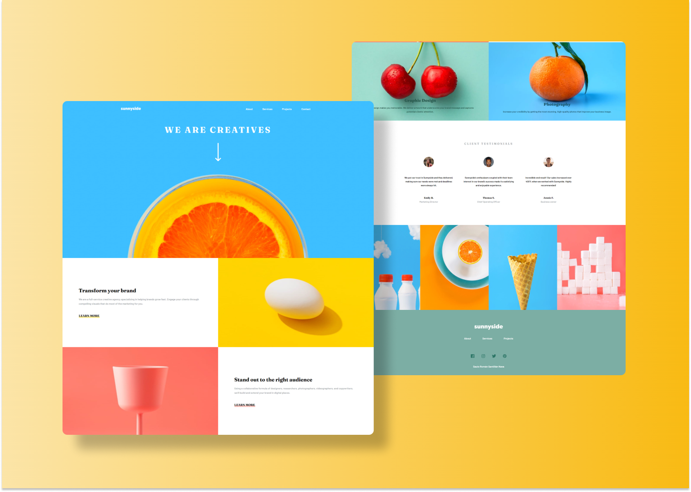

# Sunnyside &mdash; LandingPage 🌞



Sunnyside is challenge from Front-End Mentor. In this project I carried out this design with code to practice my frontend skills. It has different sections where css properties are applied for the appropiate functionality of the page like grid and flexbox. 

It is responsive, it means that design addapts to different devices and screens. JavaScript is used for menu functionality and some transitions among sections. 

## Technologies and services used

  * HTML5
  * CSS3
  * Javascript
  * BEM methodology. 
  * Media-queries
  * Netlify

If you desire to watch its functionality on live, please visit: 
```
https://sunnysitesrsn.netlify.app/
```

You don't need to install any dependency to code or to execute the application. Just download the code and enjoy.

## UI Especifications

Colors used: 

 * Primary red: #fe7867
 * Primary green: #25564b
 * Primary green-2: #458c7e
 * Primary yellow: #fad400 
 * Primary blue: #19536b
 * Primary blue-2: #23303e
 * Primary blue-3: #5a636c
 * Primary blue-4: #818498
 * Gray: #a7abae
 * White: #FFFFFF

Breaking Points:

This app follows "desktop first" principle.

 * Phone: 620px
 * Tablet: 800px
 * Desktop: 1024px